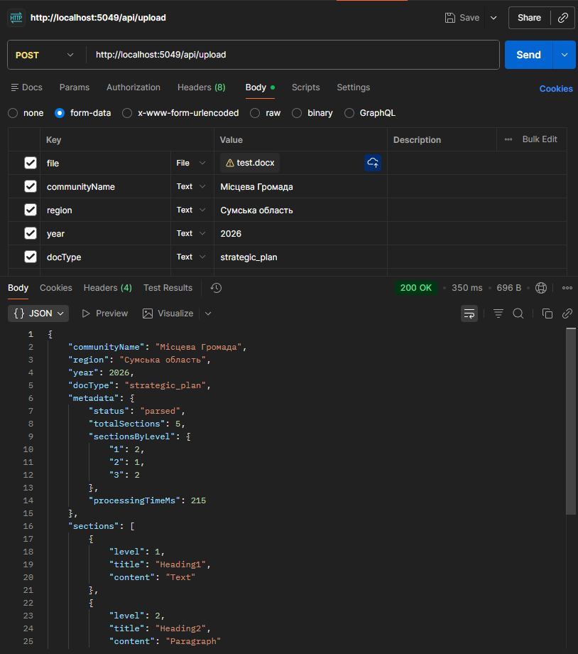

# LocalGovProcessor

> Прототип серверної частини платформи для обробки та структурування документів місцевих громад України.

---

## 1. Ground-line Vision

### Проблема

Документи місцевих громад — стратегічні плани, бюджети, рішення рад — зберігаються у форматах `.docx` та `.pdf`, які орієнтовані на людське читання. Для машинної обробки, аналізу або порівняння між регіонами ці формати непридатні.

### Ідея

Побудувати платформу, яка:
1. Приймає документи громад у сирому вигляді (`.docx`, `.pdf`)
2. Витягує структурований текст та передає його до LLM API
3. Формує стандартизований JSON з ключовими цілями, показниками та бюджетами
4. Надає цей JSON через публічний API — для відображення на інтерактивній платформі та для порівняння громад між собою

### Архітектура

```
[DOCX / PDF документи громад]
           ↓
[Processing Server — .NET / C#]
  · Валідація та парсинг файлу
  · Chunking тексту
  · Виклик LLM API (Anthropic / OpenAI)
  · Нормалізація відповіді
           ↓
[PostgreSQL — структуровані дані]
           ↓
[REST API — JSON]
           ↓
[Frontend — Node.js / JS]
  · Картки громад
  · Інтерактивні графіки
  · Порівняння регіонів
```

### Шари системи

| Шар               | Технологія                  | Відповідальність                                 |
|-------------------|-----------------------------|--------------------------------------------------|
| Processing Server | ASP.NET Core (.NET 8)       | Прийом файлів, парсинг, виклик LLM, збереження   |
| LLM Integration   | HTTP-клієнт → Anthropic API | Витяг цілей, показників, бюджетів у JSON         |
| База даних        | PostgreSQL + Dapper         | Зберігання структурованих даних та сирого тексту |
| Public API        | ASP.NET Core Controllers    | Видача даних для фронтенду                       |
| Frontend          | Node.js + Express + JS      | Візуалізація, порівняння, фільтрація             |

### Вихідний формат (цільовий JSON після LLM-обробки)

```json
{
  "id": "uuid",
  "community": "Глухівська громада",
  "region": "Сумська область",
  "year": 2024,
  "doc_type": "strategic_plan",
  "status": "processed",
  "goals": [
    {
      "title": "Розвиток дорожньої інфраструктури",
      "description": "Ремонт та будівництво доріг місцевого значення.",
      "metrics": [
        { "label": "Ремонт доріг", "value": 45, "unit": "км", "deadline": "2026" }
      ],
      "budget_uah": 12000000,
      "category": "infrastructure"
    }
  ],
  "raw_text_stored": true
}
```

Стандартизований формат дозволяє порівнювати будь-які дві громади через єдиний ендпоінт:
`GET /api/communities/compare?ids=1,2,3`

---

## 2. Local Gov Processing Server — Прототип

### Що це

Мінімальна реалізація **першого шару** платформи: бекенд-сервер на C# / ASP.NET Core, що приймає `.docx` файл, розбирає його структуру та повертає JSON.

Мета прототипу — довести, що основна механіка (завантаження → парсинг → структурований вивід) працює і готова до розширення.

### Що вже реалізовано

**Завантаження файлу** — `POST /api/upload` приймає `multipart/form-data` з файлом та метаданими громади (назва, регіон, рік, тип документу).

**Валідація на вході:**
- Тільки `.docx` формат
- Розмір до 20 MB
- Обов'язкові поля метаданих

**Парсинг `.docx`** — `DocxParserService` витягує текст зі збереженням ієрархії заголовків. Підтримує три стратегії визначення рівня заголовка:
1. Outline Level (`w:outlineLvl`) — найнадійніший сигнал
2. StyleId — для англомовних шаблонів Word (`Heading1`, `Heading2`)
3. StyleName через реєстр стилів — для україномовних та нестандартних інсталяцій Word (`Заголовок 1`)

**Структурований вивід** — JSON з секціями документу та метаданими обробки.

### Приклад відповіді

```json
{
  "communityName": "Місцева громада",
  "region": "Сумська область",
  "year": 2026,
  "docType": "strategic_plan",
  "metadata": {
    "status": "parsed",
    "totalSections": 5,
    "sectionsByLevel": { "1": 2, "2": 1, "3": 2 },
    "processingTimeMs": 38
  },
  "sections": [
    {
      "level": 1,
      "title": "Стратегічні цілі",
      "content": "Розвиток інфраструктури громади на 2024–2026 роки."
    },
    {
      "level": 2,
      "title": "Дорожня інфраструктура",
      "content": "Ремонт 45 км доріг місцевого значення. Виділено 12 млн грн."
    }
  ]
}
```

### Як запустити

```bash
git clone https://github.com/YaroslavPetrushko/LocalGovProcessor.git
cd LocalGovProcessor
dotnet restore
dotnet run
```

Тест через Postman або curl:
```
POST https://localhost:{port}/api/upload
Content-Type: multipart/form-data

file:          <файл.docx>
communityName: "Місцева громада"
region:        "Сумська область"
year:          2026
docType:       strategic_plan
```


### Що можна додати далі

| Фіча                                | Складність | Цінність                                        |
|-------------------------------------|------------|-------------------------------------------------|
| Парсинг `.pdf` (текстовий шар)      | Середня    | Більшість документів громад — PDF               |
| Виклик LLM API для витягу цілей     | Середня    | Перехід від сирого тексту до смислового JSON    |
| Збереження у PostgreSQL             | Низька     | Персистентність, можливість порівняння          |
| `GET /api/communities/compare`      | Низька     | Ключова публічна фіча платформи                 |
| Автоматичний краулінг сайтів громад | Висока     | Повна автоматизація пайплайну                   |

### Стек

- **C# / .NET 8** — мова та платформа
- **ASP.NET Core Web API** — HTTP-сервер
- **DocumentFormat.OpenXml** — парсинг `.docx`
- **Rider / Visual Studio 2026** — розробка
