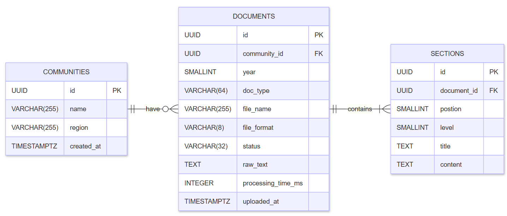
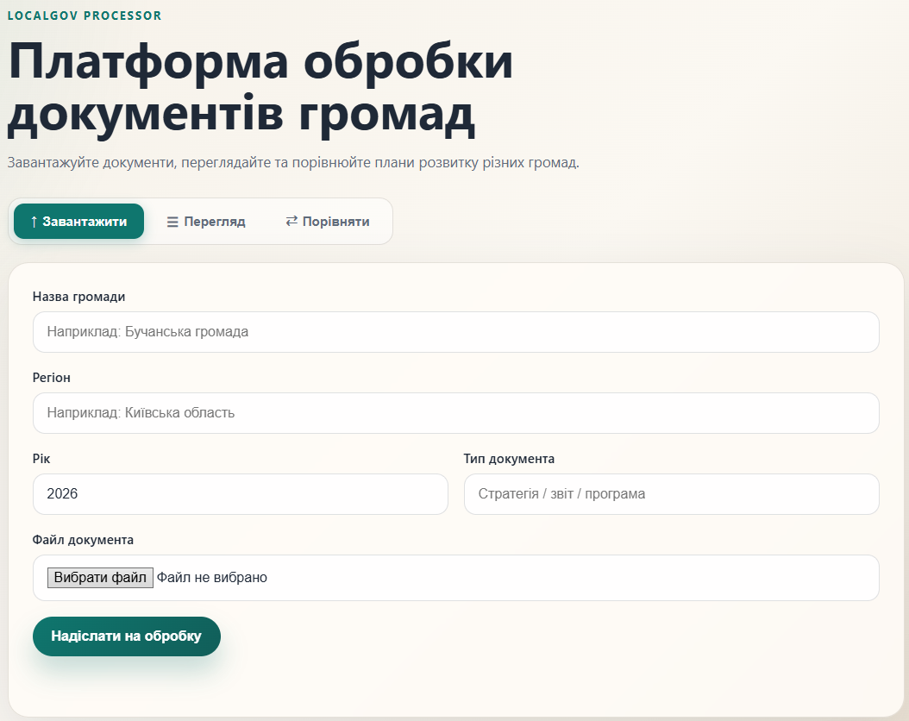

# LocalGovProcessor

> Прототип застосунку для обробки, структурування та порівняння документів місцевих громад України

---

## 1. Ground-line Vision

### Проблема

Документи місцевих громад — стратегічні плани, бюджети, рішення рад — зберігаються у форматах `.docx` та `.pdf`, які орієнтовані на людське читання. Для машинної обробки, аналізу або порівняння між регіонами ці формати непридатні.

### Ідея

Побудувати платформу, яка:
1. Приймає документи громад у сирому вигляді (`.docx`, `.pdf`)
2. Витягує структурований текст та передає його до LLM API
3. Формує стандартизований JSON з ключовими цілями, показниками та бюджетами
4. Надає цей JSON через публічний API — для відображення на інтерактивній платформі та для порівняння громад між собою

### Архітектура

```
[DOCX / PDF документи громад]
           ↓
[Processing Server — .NET / C#]
  · Валідація та парсинг файлу
  · Chunking тексту
  · Виклик LLM API (Anthropic / OpenAI)
  · Нормалізація відповіді
           ↓
[PostgreSQL — структуровані дані]
           ↓
[REST API — JSON]
           ↓
[Frontend — Node.js / JS]
  · Картки громад
  · Інтерактивні графіки
  · Порівняння регіонів
```

### Шари системи

| Шар                             | Технологія                  | Відповідальність                                 |
|---------------------------------|-----------------------------|--------------------------------------------------|
| Processing Server               | ASP.NET Core (.NET 8)       | Прийом файлів, парсинг, збереження               |
| База даних                      | PostgreSQL + EF Core        | Зберігання структурованих даних та сирого тексту |
| Public API                      | ASP.NET Core Controllers    | Видача даних для фронтенду                       |
| Web UI                          | Vanilla JS (self-hosted)    | Завантаження, перегляд, порівняння               |
| LLM Integration *(заплановано)* | HTTP-клієнт → Anthropic API | Витяг цілей, показників, бюджетів                |

### Вихідний формат (цільовий JSON після LLM-обробки)

```json
{
  "id": "uuid",
  "community": "Міська Громада",
  "region": "Сумська область",
  "year": 2024,
  "doc_type": "strategic_plan",
  "status": "processed",
  "goals": [
    {
      "title": "Розвиток дорожньої інфраструктури",
      "description": "Ремонт та будівництво доріг місцевого значення.",
      "metrics": [
        { "label": "Ремонт доріг", "value": 45, "unit": "км", "deadline": "2026" }
      ],
      "budget_uah": 12000000,
      "category": "infrastructure"
    }
  ],
  "raw_text_stored": true
}
```

Стандартизований формат дозволяє порівнювати будь-які дві громади через єдиний ендпоінт:
`GET /api/communities/compare?ids=1,2,3`

---

## 2. Local Gov Processing Server — Прототип

### Що це

Повний перший шар платформи: бекенд-сервер на C# / ASP.NET Core з веб-інтерфейсом, що дозволяє завантажувати документи громад, зберігати їх у PostgreSQL та порівнювати між собою.

Мета прототипу — довести, що основна механіка (завантаження → парсинг → структурований вивід) працює і готова до розширення.

### Реалізований функціонал

#### Парсинг документів

**`.docx` — `DocxParserService`** витягує текст зі збереженням ієрархії заголовків. Використовує три стратегії визначення рівня заголовка:
1. Outline Level (`w:outlineLvl`) — найнадійніший метод
2. StyleId — для англомовних шаблонів Word (`Heading1`, `Heading2`)
3. StyleName через реєстр стилів — для україномовних та нестандартних інсталяцій Word (`Заголовок 1`)

**`.pdf` — `PdfParserService`** витягує машинозчитуваний текстовий шар посторінково. Структурування сирого тексту PDF покладається на LLM-етап (майбутня фіча): на відміну від DOCX, PDF не зберігає семантику заголовків.

#### Збереження у PostgreSQL

`DocumentPersistenceService` зберігає результат парсингу у три таблиці:

| Таблиця       | Призначення                                         |
|---------------|-----------------------------------------------------|
| `communities` | Реєстр громад. Унікальна пара `(name, region)`.     |
| `documents`   | Документи зі статусом обробки та сирим текстом.     |
| `sections`    | Секції після парсингу — рівень, заголовок, контент. |

Поле `status` відображає стан пайплайну:
`parsed` → `processing` → `processed` / `processing_failed` / `low_quality`



Схема розрахована на розширення: коли LLM-пайплайн буде готовий, додаються колонки `goals_json` та `llm_processed_at` до таблиці `documents` без зміни існуючої структури.

#### Веб-інтерфейс (self-hosted)

Статичний фронтенд сервується безпосередньо ASP.NET Core (`UseStaticFiles`) — окремий Node.js сервер не потрібен. Три вкладки:

- **Завантажити** — форма з метаданими громади та полем для файлу. Після обробки одразу відображає структуровані секції та метадані.
- **Перегляд** — список всіх збережених громад та документів з БД. Клік на документ — повна картка з секціями.
- **Порівняти** — вибір двох документів з БД, відображення поруч у двох колонках.
#### API ендпоінти

| Метод | Endpoint                          | Опис                          |
|-------|-----------------------------------|-------------------------------|
| POST  | `/api/upload`                     | Завантаження та парсинг файлу |
| GET   | `/api/communities`                | Список громад з документами   |
| GET   | `/api/communities/documents/{id}` | Повний документ з секціями    |

### Приклад відповіді `POST /api/upload`

```json
{
  "communityName": "Глухівська громада",
  "region": "Сумська область",
  "year": 2024,
  "docType": "strategic_plan",
  "metadata": {
    "status": "parsed",
    "totalSections": 5,
    "sectionsByLevel": { "1": 2, "2": 1, "3": 2 },
    "processingTimeMs": 38
  },
  "sections": [
    {
      "level": 1,
      "title": "Стратегічні цілі",
      "content": "Розвиток інфраструктури громади на 2024–2026 роки."
    },
    {
      "level": 2,
      "title": "Дорожня інфраструктура",
      "content": "Ремонт 45 км доріг місцевого значення. Виділено 12 млн грн."
    }
  ]
}
```

### Як запустити

**Передумови:** .NET 8 SDK, PostgreSQL 15+

```bash
git clone https://github.com/YaroslavPetrushko/LocalGovProcessor.git
cd LocalGovProcessor
```
Створити БД та застосувати схему:
```bash
psql -U postgres -c "CREATE DATABASE \"LocalGovProcessor\";"
psql -U postgres -d LocalGovProcessor -f sql/schema.sql
```

Налаштувати рядок підключення у `appsettings.Development.json`:
```json
{
  "ConnectionStrings": {
    "LocalGovProcessor": "Host=localhost;Port=5432;Database=LocalGovProcessor;Username=postgres;Password=<пароль>"
  }
}
```

Запустити:
```bash
dotnet restore
dotnet run
```

Відкрити у браузері: `http://localhost:5049`




АБО

Тест через Postman / curl:
```
POST https://localhost:{port}/api/upload
Content-Type: multipart/form-data

file:          <файл.docx | файл.pdf>
communityName: "Місцева громада"
region:        "Сумська область"
year:          2026
docType:       strategic_plan
```


### Стек

|                                    |                                |
|------------------------------------|--------------------------------|
| **C# / .NET 8**                    | Мова та платформа              |
| **ASP.NET Core Web API**           | HTTP-сервер, статичні файли    |
| **Entity Framework Core + Npgsql** | ORM, підключення до PostgreSQL |
| **DocumentFormat.OpenXml**         | Парсинг `.docx`                |
| **PdfPig**                         | Парсинг `.pdf`                 |
| **Vanilla JS**                     | Фронтенд (без фреймворків)     |
| **Rider / Visual Studio 2022**     | IDE                            |

### Що далі

| Фіча                                | Складність | Цінність                                     |
|-------------------------------------|------------|----------------------------------------------|
| LLM API — витяг цілей та метрик     | Середня    | Перехід від сирого тексту до смислового JSON |
| Структурування PDF через LLM        | Низька     | PDF отримує ті самі можливості що й DOCX     |
| Автоматичний краулінг сайтів громад | Висока     | Повна автоматизація пайплайну                |
| Версіонування документів            | Середня    | Відстеження змін між роками                  |

